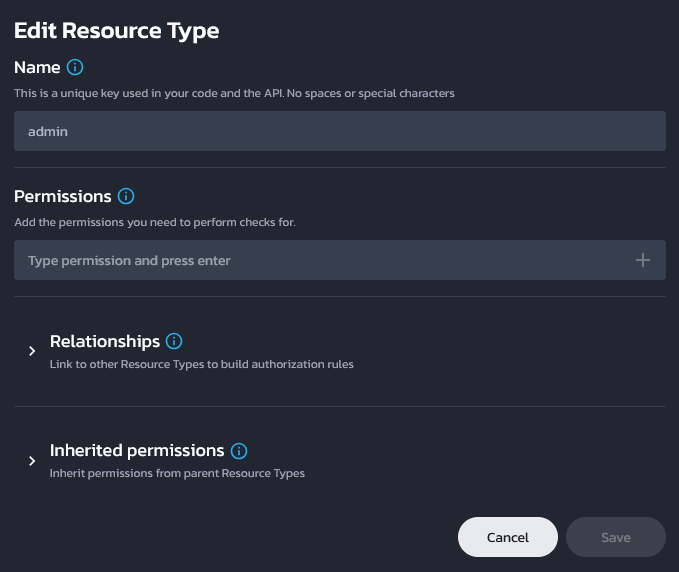
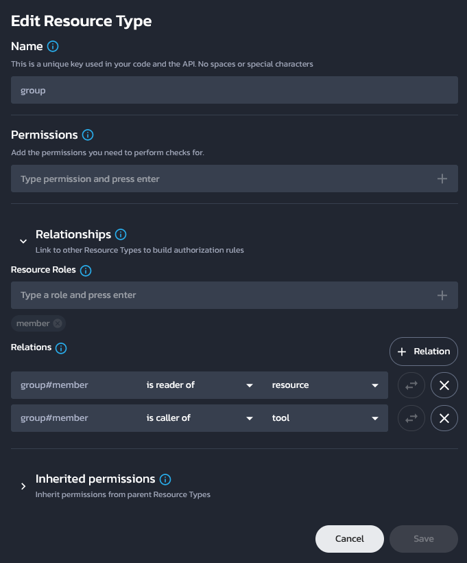
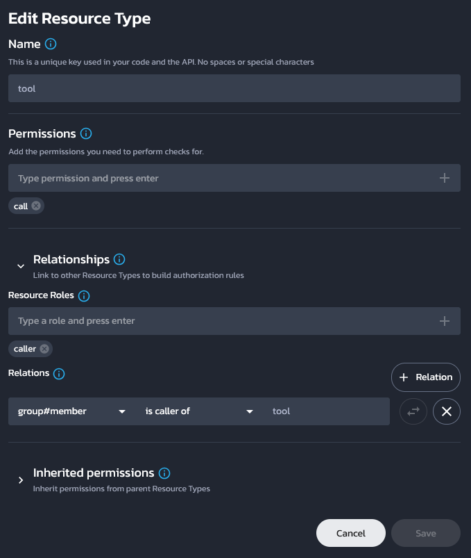

# pangea-authz-fastmcp

Easily add authorization to a FastMCP server with Pangea's [AuthZ][] service.

## Installation

```
pip install -U pangea-authz-fastmcp
```

## Pangea AuthZ setup

1. Create a Pangea account at https://pangea.cloud/signup. During the account
   creation process, an organization (top-level group) and project
   (individual app) will be created as well. On the "Get started with a common
   service" dialog, just click on the **Skip** button to get redirected to the
   developer console.
2. In the developer console, there will be a list of services in the left hand
   panel. Click the **AuthZ** service to enable it.
3. In the modal, there will be a prompt to create a new Pangea API token or to
   extend an existing one. Choose **Create a new token** and click on **Done**.
4. An additional dialog of example schemas will appear. Select **Blank Schema**
   and then click **Done**.
5. From this AuthZ Overview page, click on **Resource Types**. We'll want to
   create the following resource types:






6. Click on **Roles & Access**. We'll want to configure the following roles:


7. Click on **Assigned Roles & Relations**. From this page one can assign users
   or groups to be callers of select tools.

## Usage

Use FastMCP's `add_middleware` method to add the authorization middleware to a
FastMCP server. The middleware requires a Pangea AuthZ token (to perform
authorization checks) and a function that maps an OAuth access token to a list
of subject IDs.

```python
import os

from fastmcp.server.dependencies import AccessToken
from fastmcp.server.middleware import MiddlewareContext
from mcp.types import CallToolRequestParams

from pangea_authz_fastmcp import PangeaAuthzMiddleware


async def get_subject_ids(access_token: AccessToken, context: MiddlewareContext[CallToolRequestParams]) -> list[str]:
    # Fetch the subject ID(s) for the given access token. For example, this can
    # be just the associated user ID, or it can be a list of group IDs that the
    # user is a member of. How this function is implemented will depend on the
    # identity provider.
    return ["id1", "id2"]


mcp = FastMCP(name="My MCP Server")
mcp.add_middleware(
    PangeaAuthzMiddleware(pangea_authz_token=os.getenv("PANGEA_AUTHZ_TOKEN", ""), get_subject_ids=get_subject_ids)
)
```

If you're already using the [pangea-authn-fastmcp][] package to authenticate
users, then this package can recognize that and will automatically fetch the
user's AuthN group memberships.

```python
import os

from fastmcp import FastMCP
from pangea_authn_fastmcp import PangeaOAuthProvider

from pangea_authz_fastmcp import PangeaAuthzMiddleware

oauth_provider = PangeaOAuthProvider(...)

mcp= FastMCP(name="My MCP Server", auth=oauth_provider)
mcp.add_middleware(
    PangeaAuthzMiddleware(
        # Need an AuthN token to fetch the user's group memberships.
        pangea_authn_token=os.getenv("PANGEA_AUTHN_TOKEN", ""),

        # Still need the AuthZ token.
        pangea_authz_token=os.getenv("PANGEA_AUTHZ_TOKEN", ""),

        # get_subject_ids is no longer required.
    )
)
```

## Google Workspace groups

This package comes with an optional command-line tool that can be used to
enumerate groups from a Google Workspace and map these groups to MCP resources
and tools in AuthZ. To install it, run:

```bash
pip install -U pangea-authz-fastmcp[cli]
```

Prerequisites:

1. The [Admin SDK API](https://console.cloud.google.com/apis/library/admin.googleapis.com) must be enabled.
2. An [OAuth 2.0 client](https://console.cloud.google.com/apis/credentials).
   Download the client secret as JSON and save it to a file like `credentials.json`.

```
Usage: pangea-authz-fastmcp google-workspace [ARGS] [OPTIONS]

╭─ Parameters ────────────────────────────────────────────────────────────────────────────────────────────────────────────────────────────────────────────────╮
│ CUSTOMER --customer            The unique ID for the customer's Google Workspace account.                                                                   │
│ DOMAIN --domain                The domain name. Use this flag to get groups from only one domain. To return all domains for a customer account, use the     │
│                                --customer flag instead.                                                                                                     │
│ CREDENTIALS --credentials      The path to the credentials file. [default: credentials.json]                                                                │
│ MAX-GROUPS --max-groups        Maximum number of groups to fetch. [default: 30]                                                                             │
│ FILES --files --empty-files    Files to discover MCP servers from. [default: ['~/AppData/Roaming/Claude/claude_desktop_config.json', '~/.cursor/mcp.json',  │
│                                '~/.codeium/windsurf/mcp_config.json']]                                                                                      │
│ SUBJECT-TYPE --subject-type    [default: group]                                                                                                             │
│ RELATION --relation            [default: caller]                                                                                                            │
│ RESOURCE-TYPE --resource-type  [default: tool]                                                                                                              │
╰─────────────────────────────────────────────────────────────────────────────────────────────────────────────────────────────────────────────────────────────╯
```

```bash
export PANGEA_AUTHZ_TOKEN="pts_..."

pangea-authz-fastmcp google-workspace --credentials path/to/credentials.json --domain example.org
```

[AuthZ]: https://pangea.cloud/docs/authz/
[pangea-authn-fastmcp]: https://github.com/pangeacyber/pangea-authn-fastmcp
